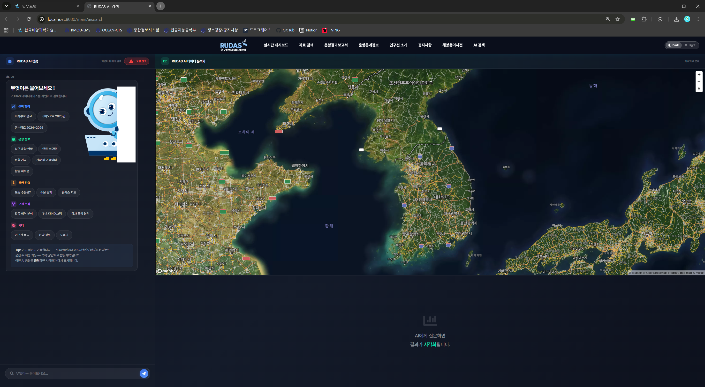
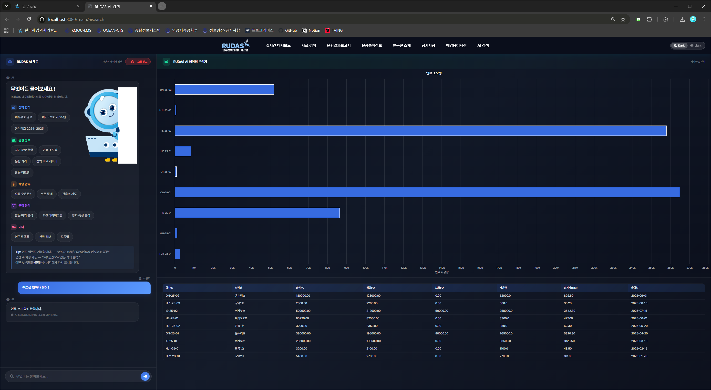
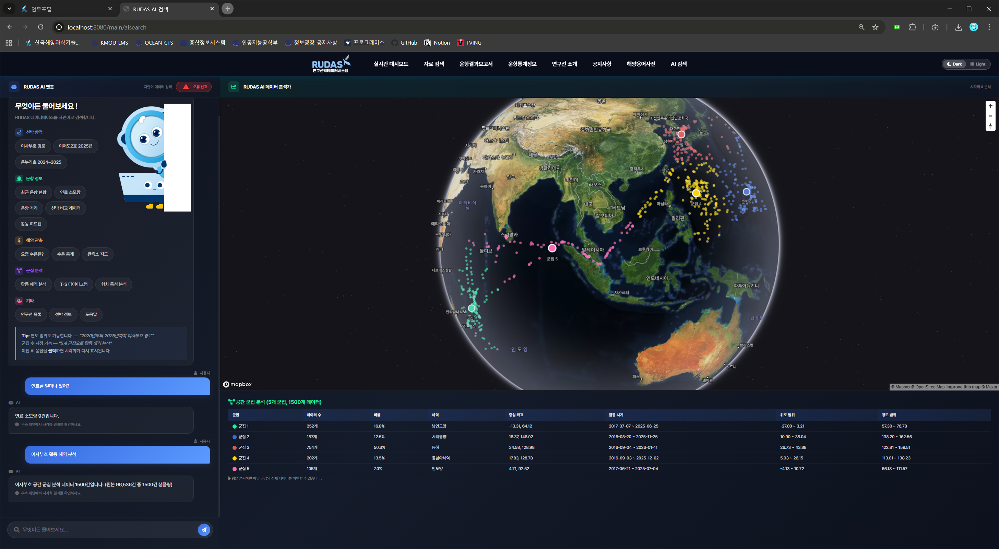
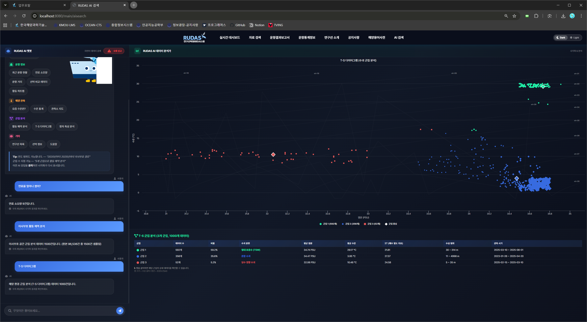
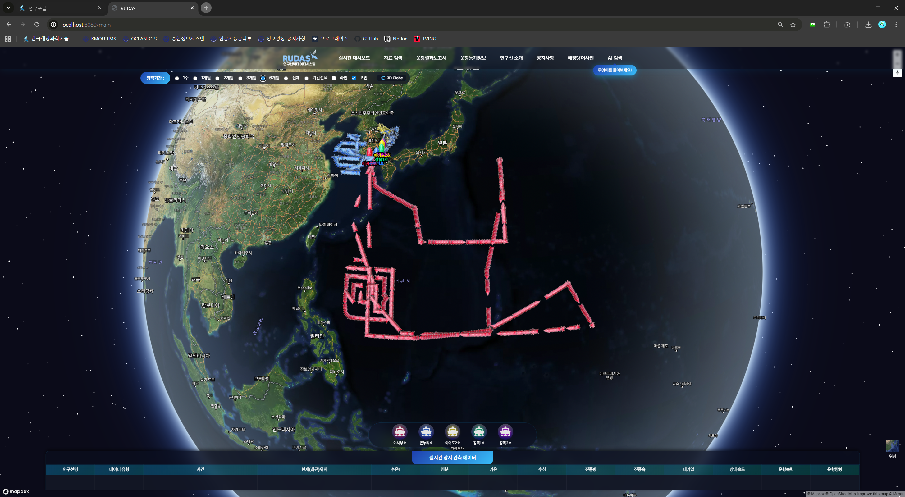
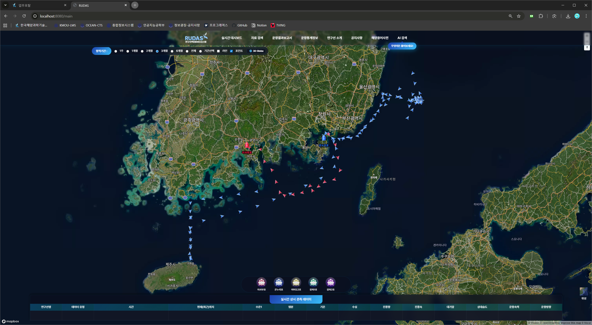
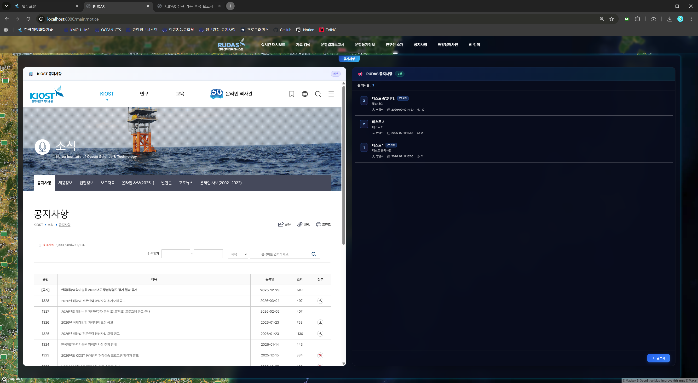

# RUDAS

**Research vessel Underway Data Acquisition System**

한국해양과학기술원(KIOST) 해양빅데이터·AI센터에서 개발한 해양 빅데이터 실시간 분석·검색 시스템

> 2026.01 ~ 2026.03 현장실습 프로젝트

---

## Overview

RUDAS는 국내 연구선(이사부호, 온누리호 등)의 운항 데이터와 해양 관측 데이터를 통합 관리하는 웹 기반 플랫폼입니다. 기존 시스템에 **AI 자연어 검색**, **해양 데이터 군집분석**, **3D 지도 시각화** 등 신규 기능을 설계·구현했습니다.

## Tech Stack

| Layer | Stack |
|-------|-------|
| Backend | Java / Spring (eGovFramework), MyBatis |
| Frontend | jQuery, Highcharts, Mapbox GL JS v3 |
| Database | PostgreSQL 17 |
| Server | Apache Tomcat 9 |
| AI/NLP | JavaScript 기반 자체 NLP 엔진 |

## Features

### 1. AI Text-to-Query 자연어 검색

자연어 질문을 SQL 쿼리로 자동 변환하는 AI 검색 엔진

- **30개 카테고리** 자동 분류 (선박, 항차, 관측데이터, 해양환경 등)
- **28개 SQL 핸들러** - PreparedStatement 기반 안전한 쿼리 실행
- 자연어 파싱 → 카테고리 분류 → 파라미터 추출 → SQL 생성 → 시각화 자동 선택

<p align="center">
  
  <br><em>AI 자연어 검색 인터페이스</em>
</p>

<p align="center">
  
  <br><em>자연어 질의 → 자동 시각화 결과</em>
</p>

### 2. K-means++ 해양 데이터 군집분석

해양 관측 데이터의 패턴을 자동 분석하는 클라이언트 사이드 군집화 엔진

- **5가지 분석 유형**: 공간 군집, 계절 패턴, 연도별 추이, 항차유형, 해양환경(T-S)
- **12종 수괴 자동 분류** (열대표층수, 북태평양중층수 등)
- T-S 다이어그램 + 등밀도선 시각화

<p align="center">
  
  <br><em>공간 군집 분석 결과</em>
</p>

<p align="center">
  
  <br><em>T-S 다이어그램 (수온-염분 산점도 + 수괴 분류)</em>
</p>

### 3. Mapbox GL JS 3D 지도 시스템

OpenLayers → Mapbox GL JS v3.9.4 전면 마이그레이션

- **3D Globe** 토글 (2D ↔ 3D 전환)
- 시네마틱 인트로 애니메이션
- Canvas API 기반 동적 선박 아이콘 생성
- DragBox 영역 검색

<p align="center">
  
  <br><em>3D Globe 뷰</em>
</p>

<p align="center">
  
  <br><em>메인 대시보드</em>
</p>

### 4. 시각화 시스템 (18종)

Highcharts + Mapbox 기반 다양한 시각화 자동 선택 엔진

| 유형 | 구현 방식 |
|------|----------|
| 테이블 / 카드 / 일정 | DOM 동적 생성 |
| 막대 / 꺾은선 / 산점도 / 레이더 / 히트맵 / 버블 차트 | Highcharts |
| 항적 / 관측소 / 군집 지도 | Mapbox GeoJSON Layer |
| T-S 다이어그램 | Highcharts Scatter + 등밀도선 |

### 5. 게시판 시스템

- **공지사항**: CRUD + 페이지네이션 + 조회수
- **AI 오류 신고**: 잘못된 AI 응답 피드백 수집

<p align="center">
  
  <br><em>공지사항 게시판</em>
</p>

### 6. 해양 용어 사전

7개 카테고리, 60+ 해양 과학 용어 검색 시스템

- 카테고리: 해양물리, 해양화학, 해양생물, 해양지질, 선박·항해, 관측장비, 기타
- 실시간 검색 필터링 + 카테고리 필터

<p align="center">
  
  <br><em>해양 용어 사전</em>
</p>

### 7. DB 최적화

3억+ 건 관측 데이터에 대한 성능 최적화

- `ROW_NUMBER()` 기반 다운샘플링 (300M → 500건)
- 부분 인덱스 (`obs_dt LIKE '%0000'`)
- 전체 조회 **30초 → 1초 미만** 단축

## Architecture

```
┌─────────────────────────────────────────────┐
│                  Frontend                    │
│  jQuery + Highcharts + Mapbox GL JS v3       │
│  NLP Parser → Category Classifier            │
│  K-means++ Clustering Engine                 │
├─────────────────────────────────────────────┤
│               Backend (JSP)                  │
│  28 SQL Handlers (PreparedStatement)         │
│  CRUD APIs (Notice, Error Report, Dict)      │
├─────────────────────────────────────────────┤
│             PostgreSQL 17                    │
│  Partial Indexes + ROW_NUMBER() Sampling     │
│  300M+ Ocean Observation Records             │
└─────────────────────────────────────────────┘
```

## Performance

| 항목 | 개선 전 | 개선 후 |
|------|---------|---------|
| 전체 관측 데이터 조회 | ~30초 | < 1초 |
| AI 질의 응답 | - | < 2초 |
| 지도 렌더링 (3D Globe) | - | 60fps |

---

<sub>KIOST 해양빅데이터·AI센터 | 현장실습생 양범석</sub>
